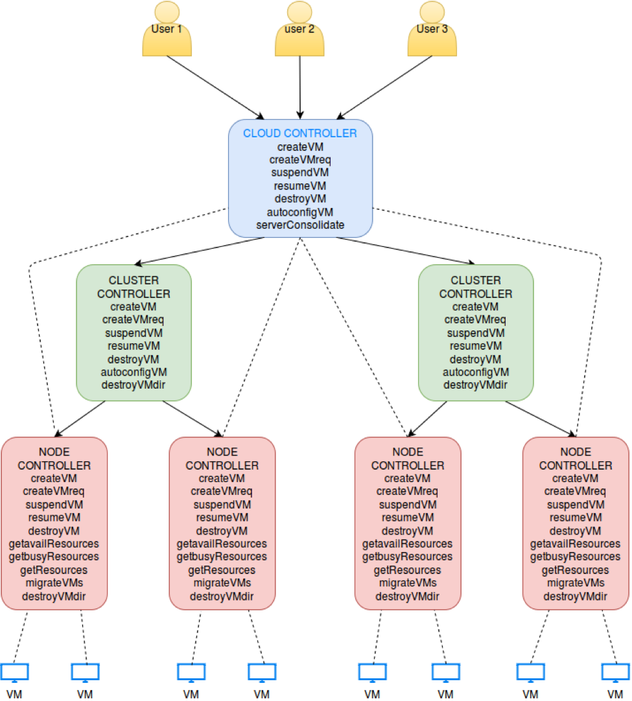
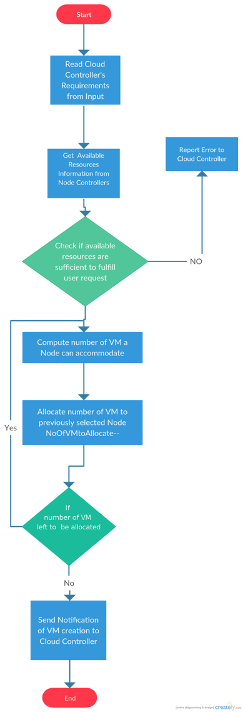
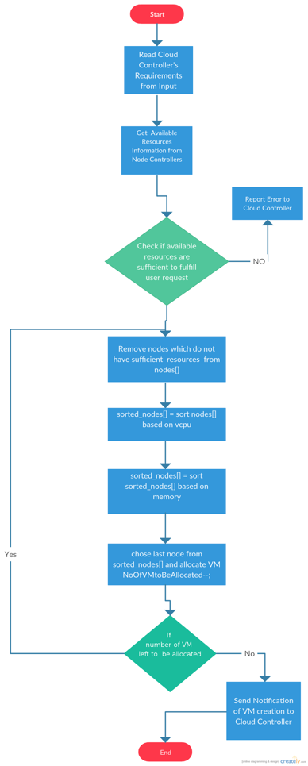
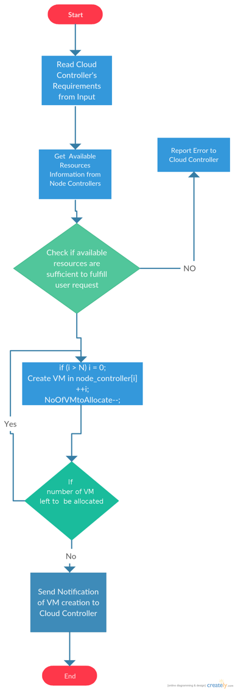
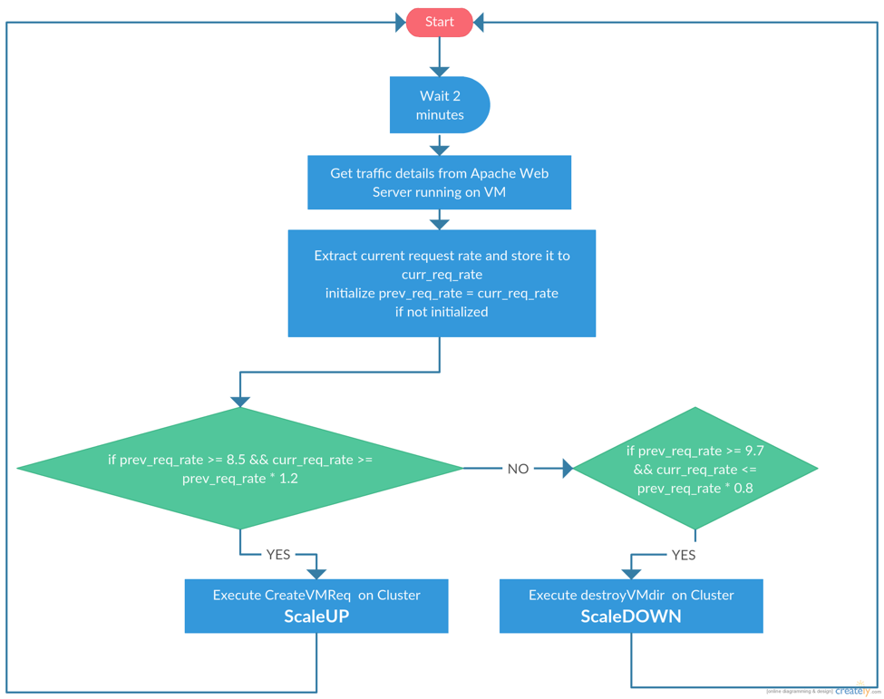
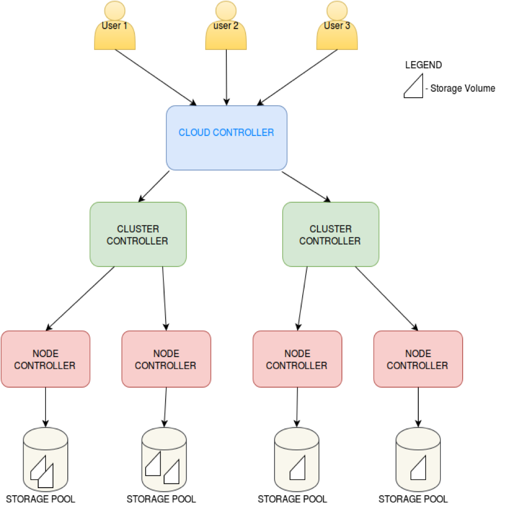
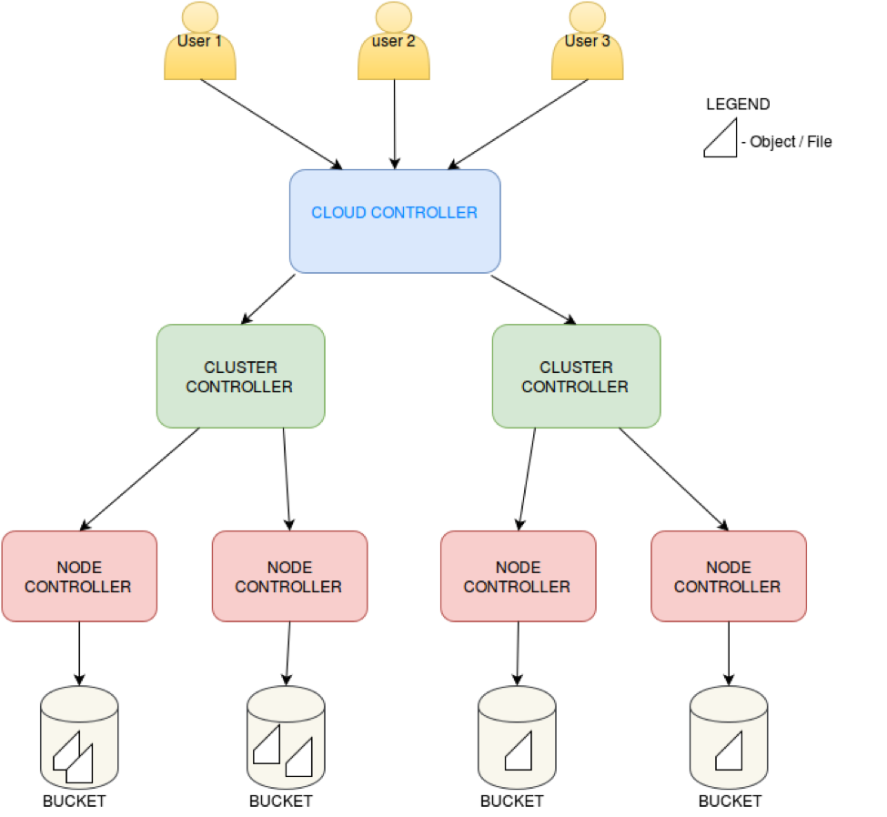

## What is Cloud?

## What is Private Cloud?

## What kind of services I can get as a cloud consumer?

## What is IaaS, SaaS, PaaS?

## What is IaaS?

Our goal is to design and implement our own private cloud providing simplified IaaS to the clients.
### 1. Client 
Client can request to create new virtual machines according to his own requirements. The requirements can be number of  virtual cpus , memory for the created virtual machines. Other initial configuration information to create the virtual machine can be used by default. Client can request to create virtual machines by name and later can also request to suspend, resume and destroy them by giving  virtual machine name and request type to cloud controller.

### 2. Cloud Controller
Cloud controller can get the request from client . it will process the received request and send commands to cluster controllers accordingly. Later cluster controllers can perform operations in their corresponding availability zones.
 
Various functions in cloud controller-
1)	createVM :-  this function is used to command the cluster controller in the corresponding availability zone for creating virtual machine by giving its name .
2)	createVMreq :-  in this function client can specify its requirements as number of virtual machines, number of cpus, memory size and availability zone for virtual machine creation.
3)	suspendVM :- in this function the running virtual machine can be suspended by using its virDomain name.this request is forwarded to the corresponding availability zone in which the virtual machine is running.
4)	resumeVM :-  in this function the paused virtual machine can be resumed by using its virDomain name.this request is forwarded to the corresponding availability zone in which the virtual machine is in paused state.
5)	destroyVM :- in this function the running virtual machine can be destroyed by using its virDomain name.this request is forwarded to the corresponding availability zone in which the virtual machine is running.
6)	autoconfigVM :- the cloud controller can turn on the autoconfig option. This option is used to monitor the traffic handled by the virtual machines. By getting this request cluster controller can start to monitor the traffic and it can according apply auto scaling up and auto scaling down dynamically.
7)	serverConsolidate :-  in this function cloud controller will gather the information from all the node controllers. This information contains their busy resources and their all resources e.g. vcpu , memory. Then it will calculate volumes for all the nodes by using the following mathematical relation :-
           
            Normalized_busy_cpus = busy_cpus / total_cpus
            Volume = 1/(1-normalized_busy_cpus)  +  1/(1-normalized_busy_memory)
            Volume_to_memory_ratio = volume / busy_memory 
           
The volume_to_memory_ratio is stored for all the nodes inside volume_memory_ratios vector. then the vector is sorted in ascending order. The node with the highest volume_memory_ratio will be considered as target for the migrated virtual machines and the node with the lowest volume_memory_ratio will be considered as source to migrate virtual machines. The source having the lowest volume_memory_ratio will be the candidate for consolidation.
After computing the source and the target for migration, cloud controller will ask for the busy resources in source and the available resources in target nodes .then it will check that all the busy resources can be make available by the migration to target node. If this condition is satisfied then cloud controller will send the target nodes’ uri to the source node by calling the function migrateVM. So that the source node can migrate all its virtual machines to the target node. After successful completion of the migration, source node can go into consolidate state.   

### 3. Cluster Controller
Cluster controller will get the requests from the cloud controller and will operate in its availability zone. It will get the virtual machine requirements from the the cloud controller and will ask to all the node controllers that they can fulfill all the requirements of the cloud controller. If they are not sufficient then it will send error message to the cloud controller. If it can fulfill then it will run some scheduling algorithm to create the virtual machines in the nodes present in their corresponding availability zones. Cluster controller can able to run greedy, round robin and matchmaking algorithm to schedule the virtual machines. 
  
   	createVM :-  this function is used to command the node controller in the corresponding     availability zone for creating virtual machine by giving its name .

RestClient::post("http://localhost:10007/node/createVM","application/json",sp.str());

createVMreq :-  in this function cloud controller specifies its requirements as number of virtual machines, number of cpus, memory size for virtual machine creation. By getting all the requirements, it will ask to all the nodes by sending requests.
           
RestClient::get("http://"+ allnodeuris[i] +"/node/getavailResources");
     	RestClient::post("http://"+ allnodeuris[i] +"/node/createVMreq","application/json",sp.str());

Then cluster controller will check that all the available resources present in that availability zone are sufficient to fulfill requirement of virtual machines or not. If they are sufficient it will execute greedy, round robin and matchmaking algorithms as shown in the flow diagram.

Greedy Algorithm

Match_Making Algorithm

Round_Robin Algorithm

suspendVM :- in this function the running virtual machine can be suspended by using its virDomain name.this request is forwarded to the corresponding node controller in which the virtual machine is running.
RestClient::post("http://localhost:10007/node/suspendVM","application/json",sp.str());

resumeVM :-  in this function the paused virtual machine can be resumed by using its virDomain name.this request is forwarded to the corresponding node controller in which the virtual machine is in paused state.
RestClient::post("http://localhost:10007/node/resumeVM","application/json",sp.str());

destroyVM :- in this function the running virtual machine can be destroyed by using its virDomain name. this request is forwarded to the corresponding node controller in which the virtual machine is running.
RestClient::del("http://localhost:10007/node/destroyVM/"+ sp.str());

destroyVMdir :- in this function the running virtual machine can be destroyed to implement the autoscaling down algorithm. this request is forwarded to the corresponding node controller in which the virtual machine is running.

RestClient::del("http://localhost:10007/node/destroyVMdir");

autoconfigVM :- The autoscaling option is used to monitor the traffic handled by the virtual machines. By getting this request cluster controller can start to monitor the traffic and it can according apply auto scaling up and auto scaling down dynamically. 

RestClient::get("http://172.50.88.15:80/server-status");

It will get the traffic information from apache web server running on virtual machine.it will check the request rate after every 2 minutes. If there is 20% increase in current request rate from the previous request rate checked before 2 minutes then it will call the method createVMdir (scaleup) on cluster controller which will create virtual machines in round robin algorithm. If there is 20% decrease in request rate then it will request to destroy (scaledown) the virtual machines.the flowchart of algorithm is shown in the diagram.

### 4. Node controller
Node controller is responsible for managing the virtual machines running on the node. It will keep the dynamic information about all the virtual machines running on the node. All the information about the virtual machines are provided by the node controller to the cluster controller and cloud controller whenever asked. It will keep an unordered map with key as the name of the virtual machine will will have the state, vcpus, memory, max memory info about the virtual machines.
virNodeInfo
struct virNodeInfo {

char model[32]
model
string indicating the CPU model
unsigned long
memory
memory size in kilobytes
unsigned int
cpus
the number of active CPUs
unsigned int
mhz
expected CPU frequency, 0 if not known or on unusual architectures
unsigned int
nodes
the number of NUMA cell, 1 for unusual NUMA topologies or uniform memory access; check capabilities XML for the actual NUMA topology
unsigned int
sockets
number of CPU sockets per node if nodes > 1, 1 in case of unusual NUMA topology
unsigned int
cores
number of cores per socket, total number of processors in case of unusual NUMA topolog
unsigned int
threads
number of threads per core, 1 in case of unusual numa topology
}
virDomainInfo
struct virDomainInfo {

unsigned char
state
the running state, one of virDomainState
unsigned long
maxMem
the maximum memory in KBytes allowed
unsigned long
memory
the memory in KBytes used by the domain
unsigned short
nrVirtCpu
the number of virtual CPUs for the domain
unsigned long long
cpuTime
the CPU time used in nanoseconds
}

createVM :-  this function will create the virtual machine by given name and include the running virtual machine information i.e. virdomaininfo in the unordered map allVMinfo.

createVMreq :-  in this function the node controller will create client specified  number of virtual machines with the specified number of cpus, memory size.and it will also add the created virtual machine information in the unordered map allVMinfo.

suspendVM :- in this function the running virtual machine is suspended by using its virDomain name. The virtual machine will go into the paused state after this. The same info will be updated in the allVMinfo corresponding to the key as virtual machine name.

resumeVM :- in this function the paused virtual machine is resumed by using its virDomain name. The virtual machine will go into the running state after this. The same info will be updated in the allVMinfo corresponding to the key as virtual machine name.

destroyVM :- in this function the running virtual machine is destroyed by using its virDomain name.The same info will be deleted in the allVMinfo corresponding to the key as virtual machine name.

destroyVMdir :- in this function the running virtual machine is destroyed. The same info will be deleted in the allVMinfo corresponding to the key as virtual machine name.

getavailResources :- this function will return the available resources at the node whenever it is requested by either cluster controller and cloud controller. Available resources will contain number of all available cpus, available memory size. 
            struct hostinformation
           {
            int availablevcpus;
            unsigned long long availablememory;
             };

getbusyResources :- this function will return the busy resources at the node whenever it is requested by either cluster controller and cloud controller. busy resources will contain number of all busy cpus, busy memory size. 

getResources :- this function will return all the resources at the node whenever it is requested by either cluster controller and cloud controller. all resources will contain number of all cpus, total memory size. 

## What is SaaS?

## What is EBS?

## What is Object Storage Service?

### Simplified EBS
PROBLEM STATEMENT
To provide an EBS like service to create and attach storage to any VM on the go. The created storage volume can then be used for other VMs as well.

PROBLEM SCOPE
Considering the storage attached to the VMs as transient, we will provide a persistent storage service on top of the cloud that has already been created in problem 1. The newly created storage volumes will be reusable by any other VMs. The contents they hold will be intact and available for reuse by any other VM, to which we attach the selected VM.

ARCHITECTURE
The storage service is being provided on top of the existing cloud infrastructure built in problem 1. The cloud controller takes inputs from the user for storage related services. The cloud cluster then sends request for the specified service to the cluster controller. The cluster controller checks which node controller has the specified domain and relays the request to the targeted node controller. The node controller then performs the specified operations. The architecture of the service is as given in the figure 1.
The users interact with the cloud controller using the exposed REST API to use the storage services. The cloud controller then interacts with the cluster controllers again using the REST APIs. The cluster controller then finds out the node controller where the domain is located and performs the services as specified by the user.  If a new storage volume has to be created then we assume that default named Storage Pool is available on each physical machine. The storage volume is created in this pool only. If there is an existing Storage Volume then that volume can be attached to any other device. The first time user of the storage has to format it so as to be able to use it. The storage volumes are attached to the VMs as USB drives. As these are persistent storage, we haven’t provided the functionality of deletion of storage volumes yet. 

Various functionalities of each cloud component such as cloud controller, cluster controller and node controller along with their URIs are given below:

CLOUD CONTROLLER

1.	Creation of Storage Volume:
	
Method: createVolume(string domain, int capacity, string unit)
This method is called by the cloud controller when a user requests to create a new volume. The user has to specify following things:
-	domain: The domain name where he/she wants a new volume
-	capacity:  The capacity of the volume to be created. It should be integer.
-	unit : This is the unit of capacity of which the drive has to be created. It must be in K/M/G/T

     2. 	Listing of all the pools:

Method: getPoolList(string domain)
This method will list all the pool names that are available on the domain

-	domain - name of the domain

Returns: A list of pool names available on the domain.
     3.   Listing of all volumes

Method: getVolumeList(string domain, string pool)
This method is invoked to get the list of volumes present in a pool specified by domain name.

-	domain : name of domain
-	pool:  name of pool

Returns: The list of all the volumes present inside a pool

    4.    Attach Volume

Method: attachVolumeToVM(string domain, string pool, string volume)
This method is invoked when a user wants to attach an existing volume to a VM.
-	domain : name of the domain
-	pool: name of the pool
-	volume: name of the volume

CLUSTER CONTROLLER
All the REST URIs are internal to cluster controller and don’t provide much of functionalities besides relaying the request to appropriate node controller. The cluster controller maintains a list of nodes that are attached to each cluster controller. It queries each of the node controller to check whether they have the specified domain or not. If present it simply calls the appropriate URIs of the node controller. 

NODE CONTROLLER
The node controller is the one responsible for providing all the services specified by the cluster controller. It invokes the appropriate methods on each REST call by the cluster controller. The functionalities of the node controller are as given below:

1.	Creation of Volume

URI:  http://ip-address:port/node/createVol
Method Type: POST
Method: createVolume(string domain, int capacity, string unit)

A new volume is created using a standard xml format already available with the node controller. The name is generated automatically based on the number of volumes already present in the pool. The format of the volume created is qcow2.
-	domain: The domain name where he/she wants a new volume
-	capacity:  The capacity of the volume to be created. It should be integer.
-	unit : This is the unit of capacity of which the drive has to be created. It must be in K/M/G/T

Returns: result json format
{ “result” : “Success” } for success
{ “result” : “Failure” } for failure

    2. List all the pools available

URI: http://ip-address:port/node/listPools
Method Type: GET
Method: getPoolList(string domain)
This method will list all the pool names that are available on the domain
-	Domain - name of the domain

Returns: A list of pool names available on the domain in the form of json.

   3. List all the volumes available

URI: http://ip-address:port/node/listVolumes
Method Type: GET
Method: getVolumeList(string domain, string pool)
This method is invoked to get the list of volumes present in a pool specified by domain name.
-	domain : name of domain
-	pool:  name of pool

Returns: The list of all the volumes present inside a pool in the form of json.

  4. Attach a Volume to a VM

URI: http://ip-address:port/node/attachVM
Method Type: POST
Method: attachVolumeToVM(string domain, string pool, string volume)
This method is invoked when a user wants to attach an existing volume to a VM.
-	domain : name of the domain
-	pool: name of the pool
-	volume: name of the volume
Returns: result json format
{ “result” : “Success” } for success
{ “result” : “Failure” } for failure

### Object Storage Service
PROBLEM STATEMENT
To provide the objectstorage service to store objects like files on physical machines. For this we will be using the architecture from the part a of problem 2.

PROBLEM SCOPE
Providing the object storage service where users will be specifying the name of file and posting the contents to the cloud controller. The cloud controller will store the file specified by the user in one of the buckets(storage space on PM) whose location is obtained by hashing the name of the file. The contents of the VM are obtained in a similar fashion.

ARCHITECTURE
The object storage service is provided on top of the architecture as specified in the part A of the problem 2. The cloud controller exposes a set of REST URIs to be used by the users to interact with the system. The architecture of the same is given below:

The users interact with the cloud controller using the exposed REST API to use the object storage services. The cloud controller then interacts with the cluster controllers again using the REST APIs. The cluster controller then performs hashing on the name of the file and finds out the bucket where to store the file.  The cloud controller stores the hash and corresponding file in a map. The cloud controller also maintains a map of the hash value and the corresponding bucket address in another map. The same process is repeated when the user needs his/her file back.
Various functionalities of each cloud component such as cloud controller, cluster controller and node controller along with their URIs are given below:

CLOUD CONTROLLER

1.	Store file
	
Method: storeFile(string filename)
Request: It contains the file contents
Method Type: POST
This method is called by the cloud controller when a user requests to store a file. The user has to specify following things:
-	Filename - name of the file
Response : Result of operation
{ “result” : “SUCCESS” } is operation succeeds
{ “result” : “FAILURE” } is operation fails

2. 	Retrieve File

Method: retrieveFile(string filename)
Method Type: GET
This method will return the content of file.

-	filename - name of the file

Response : Content of file

CLUSTER CONTROLLER
All the REST URIs are internal to cluster controller and don’t provide much of functionalities besides relaying the request to appropriate node controller where the bucket is located. 

NODE CONTROLLER
The node controller is the one responsible for providing all the services specified by the cluster controller. It invokes the appropriate methods on each REST call by the cluster controller. The functionalities of the node controller are as given below:

1.	Store File

URI:  http://ip-address:port/node/storeFile
Method: storeFile(string filename)
Request: It contains the file contents
Method Type: POST
This method actually creates a file on the bucket.
-	Filename - name of the file

Response : Result of operation
{ “result” : “SUCCESS” } is operation succeeds
{ “result” : “FAILURE” } is operation fails

   2. Retrieve File

URI: http://ip-address:port/node/retrieveFile
Method Type: GET
Method: retrieveFile(string filename)

This method will return the content of file.

-	filename - name of the file

Response : Content of file
